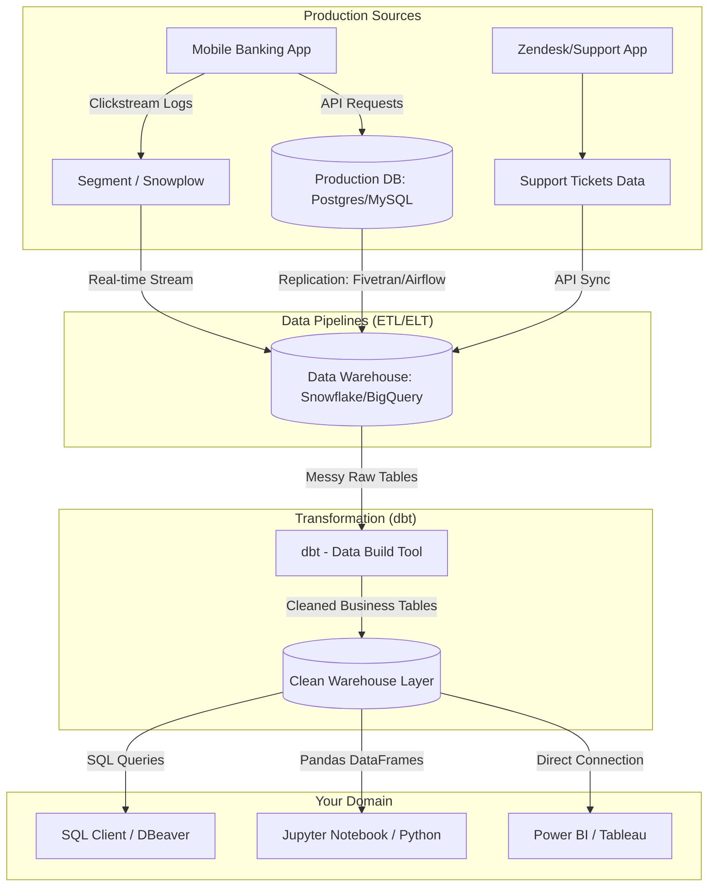

# Digital Banking Product Analytics Architecture

This document describes the flow of product data from user action to analytical insight.

## Data Pipeline Flow (Mermaid Diagram)

## Detailed Explanation of the Layers

### 1. Production Sources
* **Mobile Banking App**: The front-end client used by customers (iOS/Android).
* **OLTP (Online Transaction Processing)**: Relational databases optimized for quick reads and writes (e.g., executing transactions, checking balances).
* **Clickstream Logs**: Event triggers tracked when a user clicks a button, views a screen, or starts a process.
* **Zendesk/Support App**: Customer support portals housing ticket history, customer feedback ratings, and resolution times.

### 2. Data Pipelines (ETL/ELT)
* **ETL/ELT**: Tools like **Fivetran** or **Airflow** copy database tables out of production databases into an analytical environment.
* **Streams**: Event capture tools like **Segment** or **Rudderstack** bundle JSON tracking logs and stream them straight to the warehouse.

### 3. Data Warehouse (OLAP)
* **OLAP (Online Analytical Processing)**: A massive column-oriented database (like **Snowflake** or **Google BigQuery**) designed for querying millions of rows quickly.

### 4. Transformation (dbt)
* **dbt**: Data Build Tool allows analysts to write SQL queries that turn raw event logs into clean, structured tables (e.g. creating `fact_transactions` or `dim_users`).

### 5. Consumption Layer
* **SQL Queries**: Where you query data to answer ad-hoc questions.
* **Python**: Used for deep statistical analysis, user retention cohorts, and plotting curves.
* **Power BI**: Dashboard reporting for product managers, executives, and marketing teams.
